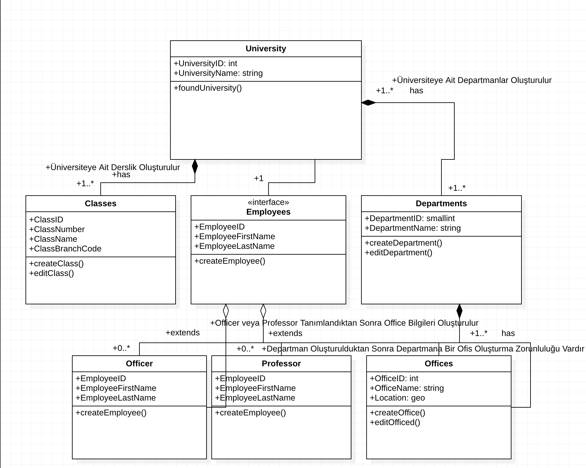

# University-Management-System-UML-Design
Üniversite Yönetim Sistemini belirtilen kriterlerce, UML tasarımı kullanarak yazılımın nasıl olacağını belirten projedir.

**Bizden İstenen Design(Tasarım)**

```
1 - Üniversiteye ait sınıflıklar, çalışma ofisleri ve departmanlar vardır.

2 - Departmanlara ait ofisler vardır.

3 - Üniversiteye ait çalışanlar vardır. Bu çalışanlar profesör veya memur olabilir.

4 - Her çalışan bir ofiste çalışır.

Bu sistemi tasvir eden Class (Sınıf) diyagramını çiziniz.

Not : Sınıflara ait nitelik ve davranışların belirtilmesine gerek yoktur.
```

**İstenen Tasarımın UML Hali**

Aşağıda, istenen tasarımın UML programı kullanılarak (StarUML) gerçekleştirilmiş hali bulunmaktadır.

Projeye ait ekran görüntüsünü paylaştıktan sonra tasarımda ifade edilmek istenenleri de resmin altına açıklama satırı olarak yazacağım.



1. **University Class**

Yukarıda ki UML Design'ı gerçek hayatta ki bir üniversitenin kurulumunun aşamaları gibidir.

Gerçek hayatta da bir üniversite kurulduğunda, ana binaya yani merkeze bağlı olarak
sınıflar, departmanlar, ve departmanlara bağlı olarak personellerin çalışabilecekleri bir ofis kurulur.

Bu zorunluluktan dolayı University Class'ına bağlı olan bu class'lar UML Design'da Composition olarak gösterilmiştir.

Yani University class'ı oluşturulur oluşturulmaz bu class'a bağlı class'ların da otomatik olarak oluşturulması gerekmektedir.

2. **Interface**

Bize verilen talebin 3.maddesinde çalışanların preföser veya memur olabilme durumundan dolayı
Üniversite bünyesinde çalışan herhangi bir kimse için ortak bir interface oluşturulmuş ve
kaydı yapılan kişinin title'ına göre ilgili class'ın interface'den nitelik ve davranışları alarak
ilgili class'larda işlemler yapılabilmesi sağlanmıştır.